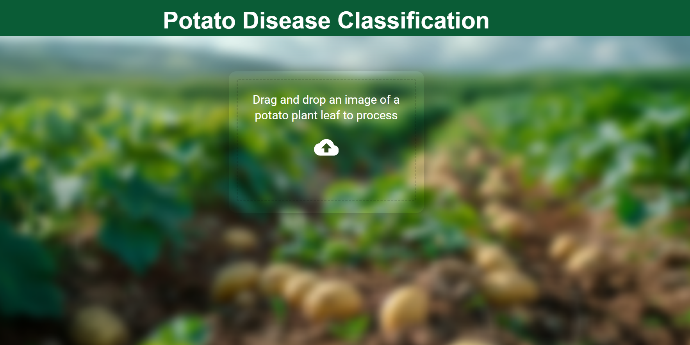
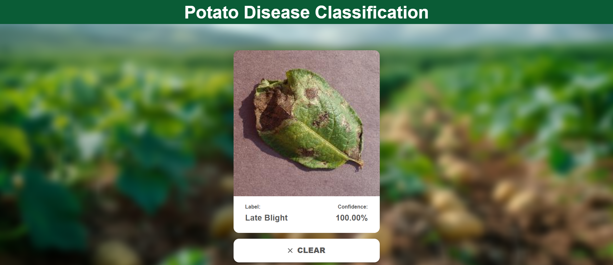

# Potato Disease Detection Website

## 🌟 Introduction

Potatoes are a vital crop worldwide, but they are highly susceptible to diseases, particularly early blight and late blight. Identifying these diseases at an early stage can help in taking timely actions to save the crop and reduce economic losses. This project leverages deep learning to build a system capable of detecting early and late blight in potato plants from leaf images.

### Problem Statement

The main objective of this project is to create a system that:

- Identifies early blight and late blight in potato plant leaves.
- Provides accurate predictions using a trained deep learning model.
- Offers an easy-to-use interface for users to drop images and get instant results.

## 🔧 Project Overview

This project consists of two major components:

1. **Frontend**: A React-based website where users can upload or drag-and-drop images to detect diseases in potato plant leaves.
2. **Backend**: A TensorFlow Serving API that hosts the trained deep learning model and processes the predictions.

The system uses a dataset of 2,152 images comprising:

- 1,000 images of early blight-infected leaves.
- 1,000 images of late blight-infected leaves.
- 152 images of healthy leaves.

The model was trained using two augmentation techniques:

- **Random Flip and Random Rotation**.
- **ImageDataGenerator**.

## 🖼️ Website Screenshot



## 🚀 Features

- Drag-and-drop image upload functionality.
- Real-time prediction using TensorFlow Serving API.
- User-friendly interface.

## 📂 Directory Structure

```
├── api
│   ├── requirements.txt
│   │
│   └── main.py
├── frontend
│   ├── public
│   ├── src
│   │   ├── components
│   │   ├── App.js
│   │   ├── index.js
│   │   └── styles.css
├── dataset
└── README.md
```

## ⚙️ Setup Instructions

### Prerequisites

- Node.js and npm installed.
- Python 3.8 or later.
- TensorFlow and TensorFlow Serving installed.

### Backend Setup

1. Clone the repository:
   ```bash
   git clone https://github.com/your-repo/potato-disease-detection.git
   cd potato-disease-detection/backend
   ```
2. Install Python dependencies:
   ```bash
   cd api
   pip install -r requirements.txt
   ```
3. Start TensorFlow Serving with the trained model:
   ```bash
   tensorflow_model_server --rest_api_port=8502 --model_name=potato_disease --model_base_path=$(pwd)/model
   ```
4. Run the backend server:
   ```bash
   main_tf_serving.py
   ```

### Frontend Setup

1. Navigate to the frontend directory:
   ```bash
   cd ../frontend
   ```
2. Install dependencies:
   ```bash
   npm install
   ```
3. Start the React development server:
   ```bash
   npm start
   ```

### Using the Application

1. Open the React application in your browser at [http://localhost:3000](http://localhost:3000).
2. Drag and drop an image of a potato leaf to detect the disease.

## 🧪 Model Training Details

1. Dataset:
   - Early Blight: 1,000 images
   - Late Blight: 1,000 images
   - Healthy Leaves: 152 images
2. Augmentation Techniques:
   - Random Flip and Random Rotation
   - ImageDataGenerator
3. Framework: TensorFlow and Keras

### Results

| Augmentation Technique | Accuracy | Loss |
| ---------------------- | -------- | ---- |
| Random Flip/Rotation   | 99.2%    | 0.02 |
| ImageDataGenerator     | 91.2%    | 0.16 |

## 🛠️ Technologies Used

- **React.js**: Frontend development.
- **TensorFlow**: Model training and backend serving.
- **Flask**: Backend API integration.
- **CSS**: Frontend styling.

## 📸 Additional Screenshots

1. **Prediction Result**
   
